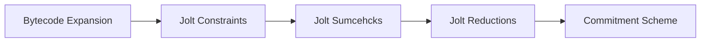

# Jolt Qed: Formally Verifying The Jolt Zk-VM

This repository contains Lean4 proofs aimed at the effort of verifying the completeness and soundness of the Jolt zk-VM.
As Jolt is a large code base, we decompose the task of formally verifying Jolt into the following components.

1. First we verify that the RISC-V program is correctly transformed into the Jolt ISA program. We have completed this phase of the project. See Bytecode expansion section for details.

2. The jolt tracer executes every instruction of the guest program written in Jolt ISA to leave behind an NP witness. The task of proving that the tracer correctly ran every instruction can be reduced to satisfying a set of constraints on the witness. This project is currently in progress, see ... for up to date progress.

3. The Jolt sum-checks are randomised efficient tests that the above constraints are satisfied. In this phase of the verification project, we extract sum-checks from Jolt, and prove that they satisfy the constraints above. 

4. At this point, if we are willing to assume an idealised polynomial commitment scheme, Jolt is complete and sound (given explicit assumptions stated in Lean theorems).

## Formally Verifying Jolt Bytecode Expansions

See [preprint](paper.pdf) or [blog series](https://randomwalks.xyz/blog/jolt-qed/) for details on the process of going from Jolt Rust code to lean proofs showing the Jolt CPU faithfully emulates a RISC-V cpu.

Details of Rust-to-Lean extraction for bytecode expansions can be found [here](https://github.com/a16z/jolt/tree/main/crates/jolt-lean-gen).

## Verifying Jolt Constraints 

## Verifying Sum-checks

## AI Usage And Miscellany

A lot of the theorems in the bytecode expansion project are very similar. 
For instance the work done to prove equivalence of `LWU` and `LW` RISC-V instructions is nearly identical. 
They differ in the application of sign vs unsigned extension. 
Often, we carefully prove `LW` with comments, and make the proof easily readable (see `LB_main.lean` for example). 
Then, we tell a chat GPT agent to complete the proof for `LW` following the exact principles and style. 
We give some guidance on the things that are different. 
This strategy has proven to be extremely valuable so far. 

On the other hand, we found that it was not good at designing definitions from scratch. 
It took a lot of back and forth, and iterations for it to come up with a design we liked. 
So for the Jolt-ISA definition, almost all of it was written by hand, then chat GPT was asked to do light formatting. 

Note, that no special skill or ai agent was employed. 
The AI usage was limited to opening two panes in a terminal, one with neo-vim running Lean, and the other with codex. 
The chats were free form.

This project was completed over a span of two and a half months, during which we learned a great deal about Lean. 
Thus, different theorems were written at different phases.
This means that some theorems are more human readable than others.
The goal was always to first have a passing proof for the correct theorem statement first. 
We wanted to know if anything was broken. 
Then, for some proofs we went and made them simpler, or more human like (akin to how one would proof things on paper, though this is not always possible).
There exists proofs that are not as ergonomic.
For example, we think that the Load expansions are much cleaner than the STORE or ATOMICS.
Over time we will improve these, but the important thing to note is that the theorems still pass.
We hope to eventually fix this, but it was not critical to progress.
Still, we welcome contributions that improve code readability.
Additionally, over time, as the project grew it is likely the import paths have become unnecessarily convoluted.

